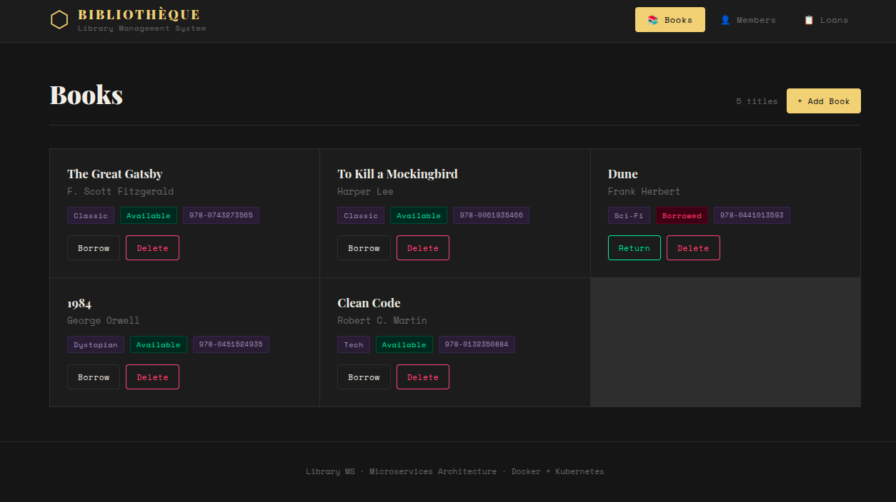
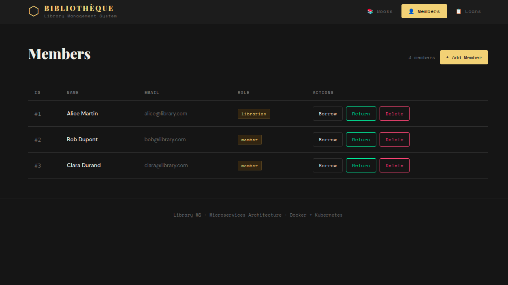
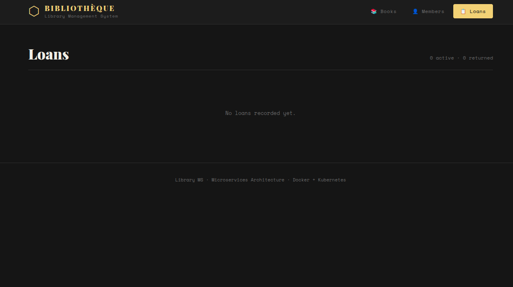

# 📚 Bibliothèque — Library Management System

A microservices-based library management application built with Node.js, React, Docker, Kubernetes, Istio and PostgreSQL.

---

## 📸 Application Preview

### Books


### Members


### Loans


---

## 🏗️ Architecture

```
  Browser
    │
    ▼
minikube service frontend        (React app — nginx)
    │
    ▼
kubectl port-forward             (local tunnel)
    ├── book-service :3001       (REST API — books CRUD)
    └── user-service :3002       (REST API — users, loans)
             │
             └──► calls book-service internally (borrow/return)
                        │
                    PostgreSQL :5432
                    (PVC 1Gi — Kubernetes)
```

---

## 🛠️ Tech Stack

| Technology | Role | Version |
|------------|------|---------|
| Node.js / Express | REST microservices | v20 LTS |
| React + Vite | Frontend | v18 |
| Docker | Containerization | latest |
| Kubernetes / Minikube | Orchestration | v1.35 |
| Istio | Service mesh + mTLS | v1.29 |
| PostgreSQL | Database | v15 |
| NGINX Ingress | API Gateway | latest |

---

## ☸️ Kubernetes Deployment (Minikube)

### Prerequisites
```bash
minikube start
minikube addons enable ingress
```

### Install Istio
```bash
curl -L https://istio.io/downloadIstio | sh -
cd istio-*/
export PATH=$PWD/bin:$PATH
istioctl install --set profile=demo -y
```

### Deploy all services (in order)
```bash
kubectl apply -f k8s/namespace-rbac.yaml
kubectl apply -f k8s/postgres.yaml
kubectl apply -f k8s/book-service.yaml
kubectl apply -f k8s/user-service.yaml
kubectl apply -f k8s/ingress.yaml
kubectl apply -f k8s/istio.yaml
```

### Enable Istio sidecar injection
```bash
kubectl label namespace library istio-injection=enabled
kubectl rollout restart deployment book-service -n library
kubectl rollout restart deployment user-service -n library
```

### Verify everything is running
```bash
kubectl get pods -n library                   # all pods → 2/2 Running
kubectl get services -n library
kubectl get ingress -n library
kubectl get peerauthentication -n library      # should show STRICT
```

### Access the app
```bash
# Terminal 1 — port forward APIs
kubectl port-forward svc/book-service -n library 3001:3001 &
kubectl port-forward svc/user-service -n library 3002:3002 &

# Terminal 2 — open frontend
minikube service frontend -n library
```

---

## 🐳 Docker — Build & Push Images

```bash
# Replace YOUR_DOCKERHUB_USERNAME with your Docker Hub username

docker build -t YOUR_DOCKERHUB_USERNAME/book-service:latest ./book-service
docker push YOUR_DOCKERHUB_USERNAME/book-service:latest

docker build -t YOUR_DOCKERHUB_USERNAME/user-service:latest ./user-service
docker push YOUR_DOCKERHUB_USERNAME/user-service:latest

docker build -t YOUR_DOCKERHUB_USERNAME/library-frontend:latest ./frontend
docker push YOUR_DOCKERHUB_USERNAME/library-frontend:latest
```

Then update `k8s/book-service.yaml`, `k8s/user-service.yaml`, `k8s/ingress.yaml` with your Docker Hub username.

---

## 🛡️ Security

### RBAC
```bash
kubectl get roles -n library
kubectl get rolebindings -n library
kubectl get serviceaccounts -n library
```

### Istio mTLS (STRICT mode)
```bash
kubectl get peerauthentication -n library
istioctl x check-inject deployment/book-service -n library
```

---

## 📡 API Reference

### book-service (port 3001)

| Method | Endpoint | Description |
|--------|----------|-------------|
| GET | `/books` | List all books |
| GET | `/books/:id` | Get a book |
| POST | `/books` | Create a book |
| PUT | `/books/:id` | Update a book |
| DELETE | `/books/:id` | Delete a book |
| POST | `/books/:id/borrow` | Mark as borrowed |
| POST | `/books/:id/return` | Mark as returned |
| GET | `/health` | Health check |

### user-service (port 3002)

| Method | Endpoint | Description |
|--------|----------|-------------|
| GET | `/users` | List all members |
| POST | `/users` | Create a member |
| DELETE | `/users/:id` | Delete a member |
| GET | `/loans` | List all loans |
| POST | `/users/:userId/borrow/:bookId` | Borrow a book (calls book-service) |
| POST | `/users/:userId/return/:bookId` | Return a book (calls book-service) |
| GET | `/health` | Health check |

---

## 📁 Project Structure

```
library-app/
├── book-service/
│   ├── index.js
│   ├── package.json
│   └── Dockerfile
├── user-service/
│   ├── index.js
│   ├── package.json
│   └── Dockerfile
├── frontend/
│   ├── src/
│   │   ├── App.jsx
│   │   ├── App.css
│   │   ├── api.js
│   │   └── components/
│   │       ├── Books.jsx
│   │       ├── Users.jsx
│   │       └── Loans.jsx
│   ├── index.html
│   ├── package.json
│   ├── vite.config.js
│   └── Dockerfile
├── k8s/
│   ├── namespace-rbac.yaml
│   ├── book-service.yaml
│   ├── user-service.yaml
│   ├── postgres.yaml
│   ├── ingress.yaml
│   └── istio.yaml
├── screenshots/
│   ├── app-books.png
│   ├── app-members.png
│   └── app-loans.png
├── docker-compose.yml
└── README.md
```

---

## ✅ Grading Checklist

| Feature | Implementation | Grade |
|---------|----------------|-------|
| 1 microservice + Docker + Kubernetes | `book-service/` | 10/20 |
| Ingress gateway | `k8s/ingress.yaml` | 12/20 |
| 2 microservices + inter-service call | `user-service/` calls `book-service` | 14/20 |
| PostgreSQL + RBAC | `k8s/postgres.yaml` + `namespace-rbac.yaml` | 16/20 |
| Istio mTLS + React frontend | `k8s/istio.yaml` + `frontend/` | 18/20 |
